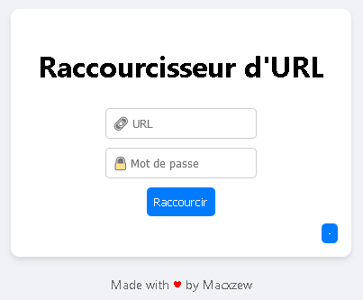

<h1 align="center">Showrt </h1>

<p align="center">
    
    
</p>

> **Showrt** is a simple, fast and secure URL shortener built with **Node.js** and **Express**.
> Protect your shortened links with a password if you want, and keep control of your URLs, self-hosted.

<p align="center"></p>

---

## ⚙️ Features

- ✂️ Shorten any URL in a click
- 🔒 Password-protect links (optional)
- 🗃️ All data stored locally (no DB needed)
- 🚦 RESTful API endpoints
- 🖥️ Clean & modern frontend (HTML/CSS)
- 💾 Quick deploy, minimal dependencies

---

## 🚀 Installation

Clone the repo and install dependencies:

```bash
git clone https://github.com/Macxzew/showrt.git
cd showrt
npm install
```

Start the server:

```bash
npm start
```

The app will run on [http://localhost:3000](http://localhost:3000).

---

## ▶️ Usage

- Open `http://localhost:3000` in your browser.
- Enter the URL you want to shorten.
- (Optional) Click ➕ to add a password for your link.
- Click **Raccourcir**.
- Copy your new short URL!

If you visit a protected short URL, you’ll be prompted for the password.

---

## 📁 Project Structure

```
showrt/
├── package.json
├── package-lock.json
├── server.js
├── urls.json
└── public/
    ├── index.html
    └── passwordPrompt.html
```

---

## 🛠️ API Endpoints

- `POST /shorten`
  **Body:** `{ "url": "<target_url>", "password": "<optional>" }`
  **Returns:** `{ "shortUrl": "<generated_url>" }`

- `GET /:id`
  Redirects to the original URL (or to the password prompt if protected)

- `POST /verify/:id`
  **Body:** `{ "password": "<password>" }`
  **Returns:** `{ "url": "<original_url>" }` if password is correct

---

## 👤 Author

- Profile: [macxzew.github.io](https://macxzew.github.io)
- Discord: [Shyno](https://discord.gg/YT7gU4FDkY)
- Github: [Macxzew](https://github.com/Macxzew)

---

## ⭐️ Show your support

Give a star if you like the project!
PRs & suggestions welcome!

---
